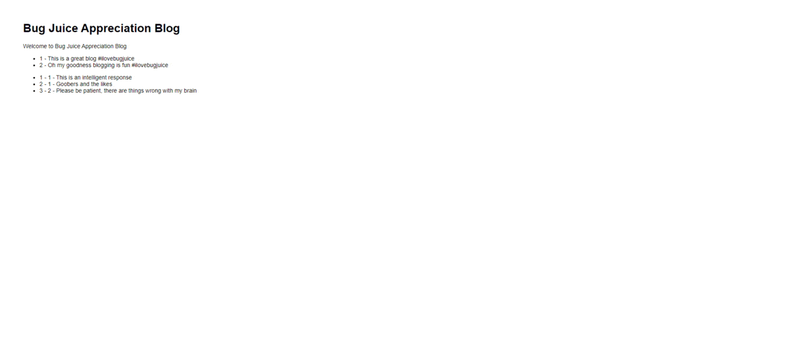

# Moth Appreciator's Anonymous Blog

This repository can be used to host a simple blogging website where users can make posts, comment on the
posts, edit comments and posts, and delete comments and posts.


Here's a timelapse of the visual improvements made on the website over it's development. Not at all necessary,
I just think it's kinda neat!

## Getting Setup

After cloning the repository, open up a terminal and run the command:

```
$ npm install
```

This will install all the necessary dependencies not included in the repository.

To host the server locally, run the command:

```
$ env:DEBUG='myapp:*'; npm start
```

Some red text may appear, but if you're not booted back to the command line then congratulations! The Moth
Appreciator's Anonymous Blog is now accessible on [localhost:3000](http://localhost:3000/)! To stop the server,
just go back to the terminal and escape the server using `ctrl + c`.

## Folders and Files

### views

- **layout.pug** The 'interface' from which every other pug file extends.
- **index.pug**  The main template used for rendering the webpage, essentially the index.html of this project.
- **error.pug**  Template used when something goes wrong rendering the webpage, usually because of a pug syntax
                 or server-side render error.

### routes

- **index.js** Server-side Java Script, sends information to the webpage to be rendered and handles interactions
               with the database.

### /data/databases

Contains the database. Isn't tracked by git.

### public

Contains files that will be sent to the webpage such as css files, client-side Java Script, images, and so on.

### /public/scripts

- **main.js**  Client-side Java Script, runs code just after loading and just before unloading the webpage.
- **popup.js** Client-side Java Script, contains functions used to construct and delete popups.

### /public/stylesheets

- **main.css**  CSS rules for the nav bar and main content of the webpage.
- **popup.css** CSS rules for popups and their contents.

### /public/images

- **icon.ico**       The webpage icon that appears on the browser tab.
- **mothLogo.png**   The logo of a moth that appears at the top of the nav bar.
- ***icon.png**      The background images used for the comment, edit, and delete buttons.
- **example(*).png** Images that would typically be in `/public/uploads/` but are kept in this folder since they are
                      used as example images when making a database and thus should be kept track of via git.

### /public/uploads

Contains files that are uploaded by users to be used for their posts. Isn't tracked by git.

## Database Structure

This server uses an SQLite3 database that has 2 tables, one to store Posts and another to store Comments.

### Posts

| Column Name       | Class    | Constraints                   | Details                                                                |
|-------------------|----------|-------------------------------|------------------------------------------------------------------------|
| **post_id**       | Integer  | Primary Key<br>Autoincrement  |                                                                        |
| **post_title**    | Text     | Not Null                      |                                                                        |
| **post_txt**      | Text     | Not Null                      |                                                                        |
| **post_image**    | Text     |                               | The name of the image in<br>/public/uploads/                           |
| **post_datetime** | Datetime | Not Null                      | Stored in UTC time, but translated<br>on the client-side to local time |

### Comments

| Column Name          | Class    | Constraints                   | Details                                                                |
|----------------------|----------|-------------------------------|------------------------------------------------------------------------|
| **comment_id**       | Integer  | Primary Key<br>Autoincrement  |                                                                        |
| **comment_txt**      | Text     | Not Null                      |                                                                        |
| **comment_datetime** | Datetime | Not Null                      | Stored in UTC time, but translated<br>on the client-side to local time |
| **post_id**          | Integer  | Not Null<br>Foreign Key       | References post_id in posts and on<br>delete cascade                   |

## Sources

This list hopefully encompasses all the outside sources I used for this project, however it isn't
impossible that I will have missed a viable source or two that I used as aid.

If you see any suspicious looking code that doesn't look like it could've been by me at my current
skill level, please let me know and I'll go look at it and cite it if I used a source for it!

### Image Sources

- [#](https://www.iconsdb.com/red-icons/delete-icon.html)
Source of commentIcon.png, deleteIcon.png, editIcon.png, and their muted counterparts
- [#](https://www.flickr.com/photos/34312269@N04/14817205051/)
Source of mothLogo.png
- [#](https://plantura.garden/uk/insects/butterflies/what-do-butterflies-eat)
Source of example(1).jpg

### Coding Sources

- [#](https://developer.mozilla.org/en-US/docs/Web/HTML/Element/input/file#unique_file_type_specifiers)
Set default accepted file types for file input
- [#](https://stackoverflow.com/questions/2825856/html-button-to-not-submit-form)
Have a button inside a form not 'activate' the form
- [#](https://stackoverflow.com/questions/387736/how-to-stop-event-propagation-with-inline-onclick-attribute)
How to stop propagation with the onclick attribute
- [#](https://developer.mozilla.org/en-US/docs/Web/API/Element/animate)
Animating with JS
- [#](https://stackoverflow.com/questions/9183381/how-to-have-click-event-only-fire-on-parent-div-not-children)
Only having a click event trigger on parent container, not on the children
- [#](https://stackoverflow.com/questions/1141639/how-to-semantically-provide-a-caption-title-or-label-for-a-list-in-html)
Providing a 'label' for an unordered list 
- [#](https://stackoverflow.com/questions/5129624/convert-js-date-time-to-mysql-datetime)
Getting current datetime in SQL format
- [#](https://stackoverflow.com/questions/21194934/how-to-create-a-directory-if-it-doesnt-exist-using-node-js)
Creating directories if they do not exist yet
- [#](https://stackoverflow.com/questions/5890250/on-delete-cascade-in-sqlite3)
Using PRAGMA to enable foreign keys
- [#](https://stackoverflow.com/questions/23691194/node-express-file-upload)
Checking for and storing user uploaded files
- [#](https://developer.mozilla.org/en-US/docs/Web/JavaScript/Reference/Global_Objects/Array/forEach)
How to write for each loops in JS
- [#](https://stackoverflow.com/questions/712689/css-div-stretch-100-page-height)
Stretching a div to 100% of the page, not just 100% of the visible window
- [#](https://stackoverflow.com/questions/9017120/how-to-keep-floating-div-inside-frame-of-parent-div)
Expanding a parent container to ensure it envelops all it's children/content using overflow
- [#](https://www.w3schools.com/cssref/pr_background-image.php)
Setting background to an image
- [#](https://www.w3schools.com/howto/howto_js_popup.asp)
Help with creating popups
- [#](https://stackoverflow.com/questions/10830357/javascript-toisostring-ignores-timezone-offset)
Converting datetime from stored UTC time to local time
- [#](https://stackoverflow.com/questions/5697605/limit-the-size-of-a-file-upload-html-input-element)
Limiting the size of a file upload
- [#](https://developer.mozilla.org/en-US/docs/Web/API/Document/cookie)
How to use cookies
- [#](https://developer.mozilla.org/en-US/docs/Web/API/Element/scrollTo)
Scrolling to a specific position in the page
- [#](https://www.tablesgenerator.com/markdown_tables)
Help with generating markdown tables